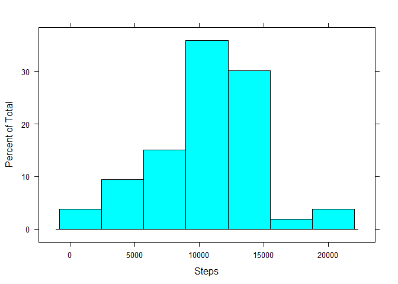
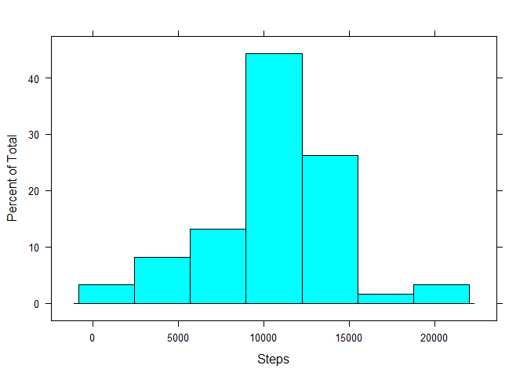
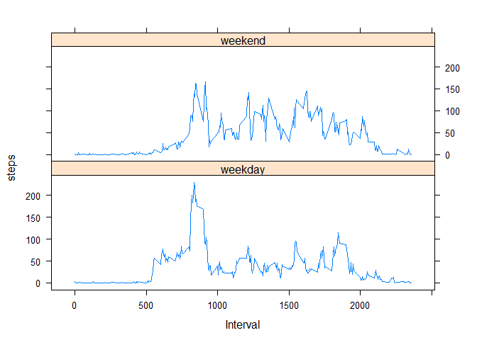

# Reproducible Research: Peer Assessment 1

## Loading and preprocessing the data

```r
data <- read.csv('activity.csv')
head(data, n = 10L)
```

```
##    steps       date interval
## 1     NA 2012-10-01        0
## 2     NA 2012-10-01        5
## 3     NA 2012-10-01       10
## 4     NA 2012-10-01       15
## 5     NA 2012-10-01       20
## 6     NA 2012-10-01       25
## 7     NA 2012-10-01       30
## 8     NA 2012-10-01       35
## 9     NA 2012-10-01       40
## 10    NA 2012-10-01       45
```

## What is mean total number of steps taken per day?
1. Calculate the total number of steps taken per day

```r
options(warn=-1)
library(plyr)
step_sum <- ddply(data[!is.na(data$steps),], .(date), summarize, steps = sum(steps))
```

2. Make a histogram of the total number of steps taken each day

```r
library(lattice)
histogram(step_sum$steps, xlab = 'Steps')
```

 

3. Calculate and report the mean and median of the total number of steps taken per day

```r
mean(step_sum$steps)
```

```
## [1] 10766.19
```

```r
median(step_sum$steps)
```

```
## [1] 10765
```


## What is the average daily activity pattern?
1. Make a time series plot (i.e. type = "l") of the 5-minute interval (x-axis) and the average number of steps taken, averaged across all days (y-axis)

```r
interval_steps <- ddply(data[!is.na(data$steps),], .(interval), summarize, steps = mean(steps))
xyplot(steps ~ interval, data = interval_steps, type='l', xlab = 'Interval', ylab = 'Steps', main = 'Average steps')
```

 

2. hich 5-minute interval, on average across all the days in the dataset, contains the maximum number of steps?

```r
max_step_num <- interval_steps[interval_steps$steps == max(interval_steps$steps),]$interval
max_step_num
```

```
## [1] 835
```


## Imputing missing values
1. Calculate and report the total number of missing values in the dataset (i.e. the total number of rows with NAs)

```r
missing_value_num <- sum(is.na(data$steps))
print(missing_value_num)
```

```
## [1] 2304
```

2. Devise a strategy for filling in all of the missing values in the dataset.
3. Create a new dataset that is equal to the original dataset but with the missing data filled in

```r
missing_data_filled <- data
missing_data_filled[is.na(missing_data_filled$steps),]$steps <- interval_steps$steps
```

4. Make a histogram of the total number of steps taken each day and Calculate and report the mean and median total number of steps taken per day.

```r
new_step_sum <- ddply(missing_data_filled, .(date), summarize, steps = sum(steps))
histogram(new_step_sum$steps, xlab = 'Steps')
```

 

```r
mean(new_step_sum$steps)
```

```
## [1] 10766.19
```

```r
median(new_step_sum$steps)
```

```
## [1] 10766.19
```


## Are there differences in activity patterns between weekdays and weekends?
1. Create a new factor variable in the dataset with two levels - "weekday" and "weekend" indicating whether a given date is a weekday or weekend day.

```r
missing_data_filled$day <- factor(weekdays(as.Date(missing_data_filled$date)))
levels(missing_data_filled$day)
```

```
## [1] "Friday"    "Monday"    "Saturday"  "Sunday"    "Thursday"  "Tuesday"  
## [7] "Wednesday"
```

```r
levels(missing_data_filled$day) <- c('weekday','weekday','weekend','weekend','weekday','weekday','weekday')
```

2. Make a panel plot containing a time series plot (i.e. type = "l") of the 5-minute interval (x-axis) and the average number of steps taken, averaged across all weekday days or weekend days (y-axis). 

```r
processed <- ddply(missing_data_filled, .(interval, day), summarize, steps = mean(steps))
xyplot(steps ~ interval | day, data = processed, type='l', layout = c(1, 2), xlab = 'Interval')
```

 


